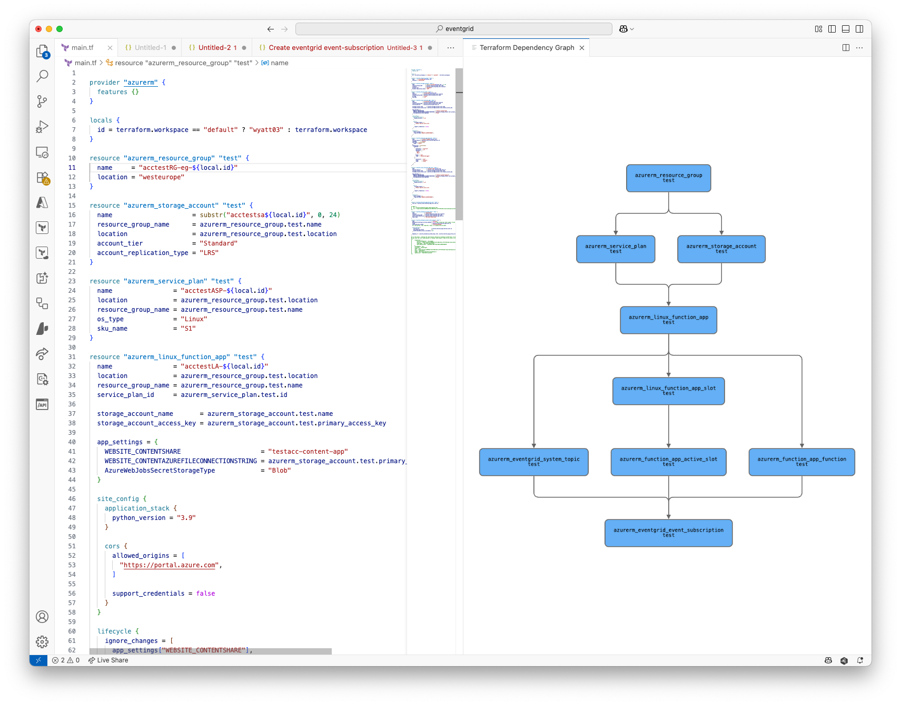

# (yet another) Terraform Graph Viewer

A VS Code extension that provides a visual representation of your Terraform dependency graph.

## Features

- Visualizes Terraform resource dependencies in a clear, interactive graph
- Shows resource types and names in an easy-to-read format
- Supports zooming and panning for large graphs
- Different colors for data sources and resources
- Curved edges with directional arrows showing dependencies

## Usage

1. Open a Terraform workspace
2. Run the command "Terraform: Open Dependency Graph" from the command palette
3. The graph will appear in a new editor panel

## Requirements

- VS Code 1.102.0 or higher
- Terraform installed and accessible in your PATH

## Extension Settings

This extension currently has no configurable settings.

## Known Issues

None at this time.

## Release Notes

### 0.0.1

Initial release:
- Basic graph visualization
- Resource and data source differentiation
- Interactive graph with zoom and pan
- Curved dependency arrowsgraph-vscode README
